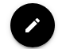
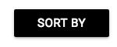
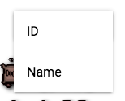

# Welcome to The Ultimate Binding of Isaac Item Tracker

## [Link to Site](https://bindingofisaactracker.firebaseapp.com/)

## [Link to Backend Code](https://github.com/collinsbj/Binding-of-Isaac-Item-Tracker-Backend)

Welcome to the only Binding of Isaac item tracker you'll ever need, thoughtfully named: The Ultimate Binding of Isaac Item Tracker, aka UBIIT (yoo-bit)! New to town? Let's take a quick tour, shall we?

## What is The Binding of Isaac?

I'm so glad you asked! According to Steam: The Binding of Isaac is a randomly generated action RPG shooter with heavy Rogue-like elements. Following Isaac on his journey players will find bizarre treasures that change Isaac’s form giving him super human abilities and enabling him to fight off droves of mysterious creatures, discover secrets.

TLDR: A super dope game that will take your soul (in a good way).

## The Item Tracker

The Tracker is where you can keep track of every item you've collected as well as get information about that item. Just found an item but you're not sure what it does? Sweet! Simply find the item in the list and tap on it. All the information about the item you could ever want will pop up for you, so you know exactly what the item you're looking at does. Totes easy.

Now that you know exactly what the item does go ahead and pick it up. The Item Tracker page will also track which items you've already picked up, making it easy to see which items you are still in need of. To switch to "edit" mode simply tap the pencil icon in the top left corner of the page. The button will change from black to red to let you know that you are in edit mode.

Edit mode off:

Edit mode on:

Now when you tap an item, instead of displaying all of the information of that item, it'll gray out, denoting that you've picked that item up.

You also have the option of sorting the item list by their ID's or names. Just tap the "Sort By" button in the top right corner and choose how you'd like to sort the item list.

## Add New Item

Add New Item is where you, dear reader, can add items that might be missing from the Tracker or Item List. You might say to yourself "Bro, you like totally don't have Succubus on here at all!" If you feel so inclined, simply head over to Add New Item, enter all the necessary information, and BOOM! Succubus will join its friends on the Item Tracker. FYI: bindingofisaacrebirth.gamepedia.com is a great place to get png's to use for the image.

## Future

What does the future hold for UBIIT? Geez, you're full of great questions today! Here's a list of features I plan on adding:

* Add all 534 items, 125 trinkets, consumables, characters, rooms, bosses, monsters, and item synergies
* Add the ability to search for items
* ~~Combining the Item List and Tracker into one, do-it-all, spot~~ Done
* ~~Add the ability to sort items by different parameters~~ Done

Ideas? Questions? Comments?

Please don't hesitate to shoot me an email at CollinsBJ@me.com if you have any feature requests, questions, or comments about UBIIT. Happy grinding!

## Local Set Up

* Front End: Fork this repo and clone it locally. No dependencies need to be installed.
* Back End: Fork this repo, clone it locally, and run npm install in the folder to install all dependencies.

License MIT
